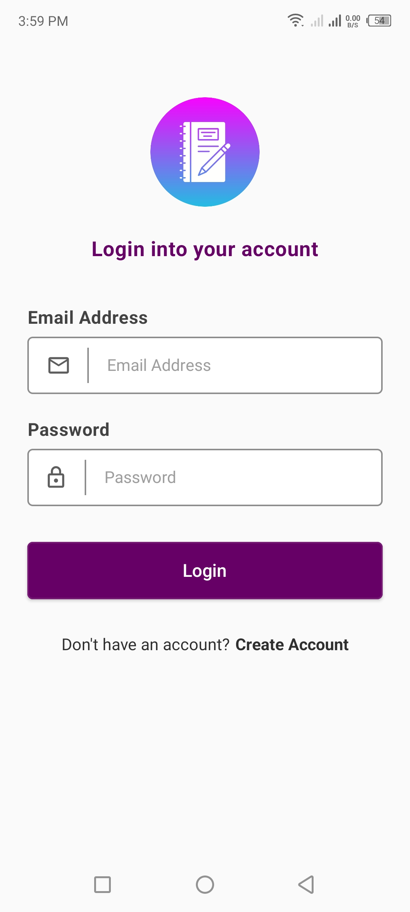
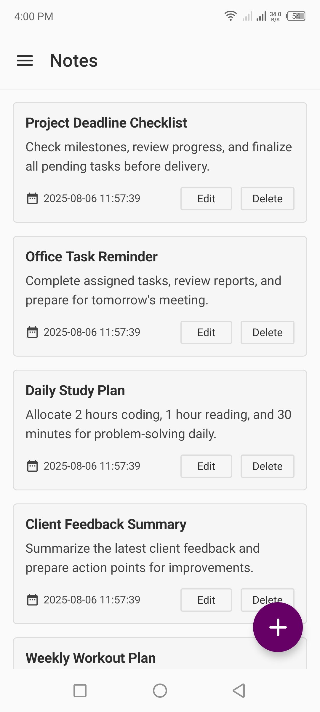
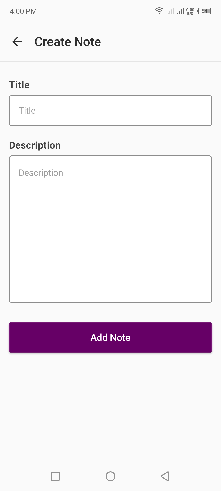
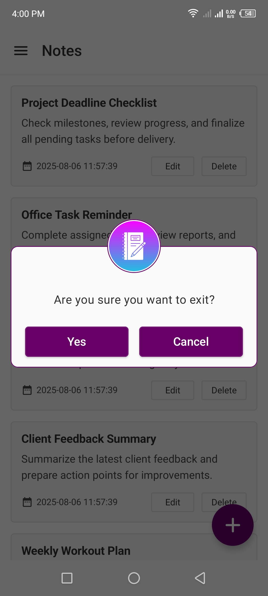

# 📒 NoteCraft Compose (MVVM)
> 📝 A modern note-taking app built with **Jetpack Compose**, showcasing a clean **MVVM architecture**, **state management**, and best Android development practices.  
> This project demonstrates the use of **Compose, Hilt, Retrofit, and Coroutines** to build scalable and efficient Android apps.

 

## 🚀 Features
- 🔐 **User Authentication** – Register and log in securely  
- 📝 **Create, Edit, and Delete Notes** – Manage your notes effortlessly  
- 🔄 **Update Profile** – Modify user details anytime  
- 🔑 **Change Password** – Update password with secure validation  
- 🎨 **Modern UI** – Fully built using **Jetpack Compose + Material 3** for a smooth, responsive experience  
- ☁️ **API Integration** – Sync notes with a backend server using **Retrofit + Coroutines**  

 

## 🛠 Tech Stack
- **Language:** Kotlin  
- **UI:** Jetpack Compose + Material 3  
- **Architecture:** MVVM + State Management (remember, MutableState)  
- **Dependency Injection:** Hilt  
- **Navigation:** Jetpack Compose Navigation  
- **Networking:** Retrofit + Coroutines  

 

## 📱 Screenshots
| Login | View Notes | Create Note | Exit |
|-------|------------|-------------|------|
|  |  |  |  |

 

## 📦 Download APK
👉 [**Click here to download**](https://github.com/its-hazratbilal/notecraft-compose-mvvm/releases/download/v1.0.1/NoteCraft-Compose-v1.0.1.apk)

 

## 🧑 Author
**Hazrat Bilal**  
- [**LinkedIn**](https://linkedin.com/in/hazrat-bilal-24672817a/)  
- [**Portfolio**](https://hazratbilal.com/)
